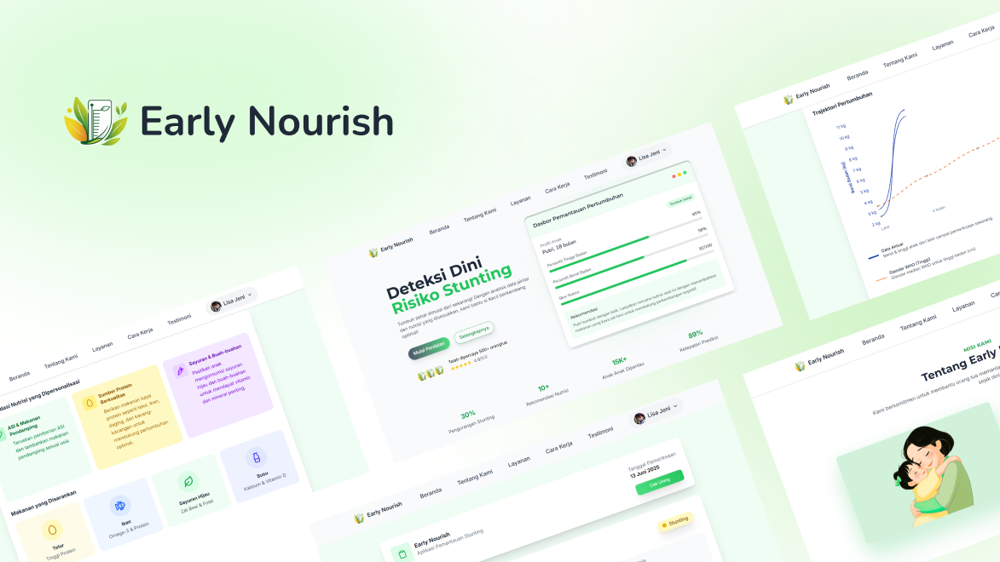

# 🌾Early Nourish 
### *Smart Stunting Detection for Better Child Growth*

Early Nourish adalah aplikasi inovatif yang dirancang untuk membantu orang tua, khususnya yang memiliki balita usia 0-5 tahun, dalam mendeteksi risiko stunting secara dini. Dengan memanfaatkan kekuatan Machine Learning, aplikasi ini mampu memberikan prediksi dengan akurasi mencapai **89%**.

## Tim Pengembang

  
| **Machine Learning Team** | **Web Development Team** |
|:---:|:---:|
| <a href="https://github.com/IrmaDwiyanti"> **Irma Dwiyanti** ML Developer</a> | <a href="https://github.com/elmosius"> **Elmosius Suli** Full-stack Developer</a> |
| <a href="https://github.com/irma3111111"> **Irma Rohmatillah** ML Developer</a> | <a href="https://github.com/JGkwen"> **Joshua Subianto** Backend Developer</a> |
| <a href="https://github.com/spicynoon"> **Yandiyan** ML Developer</a> | <a href="https://github.com/nadhilazz"> **Nadhila Azzahra** UI/UX Designer</a> |

## Fitur Utama

Berikut adalah fitur-fitur utama yang tersedia di aplikasi Early Nourish:

| Fitur | Deskripsi | 
|-------|-----------|
| **Manajemen Profil** | Pengguna dapat membuat akun dan mengubah informasi profil mereka | 
| **Asesmen Stunting** | Mengisi data asesmen anak untuk mendapatkan prediksi status gizi dan potensi risiko stunting | 
| **Dashboard Hasil Prediksi** | Menampilkan hasil prediksi secara informatif dan mudah dipahami | 
| **Riwayat Pertumbuhan** | Menyimpan dan menampilkan riwayat asesmen serta kesimpulan pertumbuhan anak | 
| **Autentikasi** | Sistem login dan register yang aman untuk pengguna | 

 

> **⚠️ Status Aplikasi: Versi Beta (alias belum sepenuhnya berfungsi hehe)**
>
> Harap diperhatikan bahwa aplikasi Early Nourish saat ini masih dalam tahap **Beta**. Ini berarti beberapa fitur mungkin belum berfungsi sepenuhnya atau belum diimplementasikan, seperti:
> - Fitur Kontak/Dukungan (Contact).
> - Fitur Unduh PDF untuk hasil asesmen.
> - Dan beberapa fungsionalitas lainnya mungkin masih dalam pengembangan.
>
> Selain itu, ada kemungkinan Anda masih akan menemukan beberapa bug atau kesalahan yang tidak terduga selama penggunaan. Kami sangat menghargai kesabaran dan masukan Anda untuk membantu kami meningkatkan aplikasi ini.
> 

 

## Teknologi Utama yang Digunakan

Proyek Early Nourish dibangun menggunakan berbagai teknologi modern untuk setiap komponennya:

| Divisi                 | Teknologi Utama                                                                                                                                                                                                                                                                                                                                 |
| :--------------------- | :---------------------------------------------------------------------------------------------------------------------------------------------------------------------------------------------------------------------------------------------------------------------------------------------------------------------------------------------- |
| **Layanan Backend API** |      |
| **Aplikasi Frontend** |     |
| **Layanan Machine Learning (ML) API** |       |

 

## URL Akses Publik

Berikut adalah URL untuk mengakses berbagai komponen aplikasi Early Nourish yang telah di-deploy secara publik:

- **Aplikasi Frontend:**
  - URL: [https://early-nourish.vercel.app](https://early-nourish.vercel.app)

- **Layanan Backend (API):**
  - URL: [api-be-earlynourish.my.id](https://api-be-earlynourish.my.id/)
  - Spesifikasi API Lengkap: [Lihat Dokumen Google Docs](https://docs.google.com/document/d/e/2PACX-1vT-Xnj15juPZrIf6XIM5KhnbTWI0JfqC1B8D7FWT38mNl9kzC6qESgTvN0AHyp_m7HQJlsJaLMJoK-J/pub)

- **Layanan Machine Learning (Dokumentasi API):**
  - URL: [api-ml-earlynourish.my.id/docs](https://api-ml-earlynourish.my.id/)

 

## Arsitektur Proyek

Proyek ini terdiri dari beberapa komponen utama:

- **Frontend:** Antarmuka pengguna yang dibangun menggunakan Vue.js.
- **Backend:** Server API yang menangani logika bisnis, manajemen data, dan autentikasi, dibangun dengan Node.js dan framework Hapi.
- **Machine Learning (ML):** Layanan yang menyediakan model prediksi stunting, dibangun dengan Python dan FastAPI.

 

## Detail Teknis dan Instalasi

Untuk detail teknis, prasyarat, dan petunjuk instalasi masing-masing komponen, silakan merujuk ke README di sub-direktori berikut:

- [**Backend (`back-end/`)**](./back-end/README.md) atau bisa melihat [branch back-end](https://github.com/Elmosius/EarlyNourish/tree/back-end)
- [**Frontend (`front-end/`)**](./front-end/README.md) atau bisa melihat [branch front-end](https://github.com/Elmosius/EarlyNourish/tree/front-end)
- [**Machine Learning (`ml/`)**](./ml/README.md) atau bisa melihat branch [ml](https://github.com/Elmosius/EarlyNourish/tree/ml)

 

---
*Proyek ini merupakan bagian dari Capstone Project Coding Camp 2025.*
